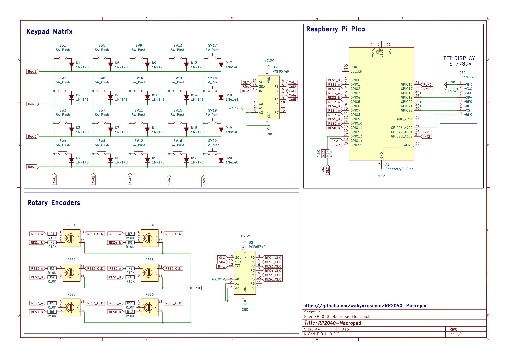

# RP2040 Macropad

This is a macropad firmware for Raspberry Pi Pico RP2040 written in Circuitpython. This firmware support up to 8 rotary encoders, 20 buttons, and a TFT display. Or you can just adjust it like however you like.

### Table of Contents
- [RP2040 Macropad](#rp2040-macropad)
    - [Table of Contents](#table-of-contents)
    - [Features](#features)
  - [🛠 Build](#-build)
    - [Hardwares Needed](#hardwares-needed)
    - [Schematic](#schematic)
    - [Software](#software)
    - [Installation](#installation)
    - [Configuration](#configuration)
    - [My Build Log](#my-build-log)

### Features

- 6 Rotary encoders.
- 240\*240 TFT Display to display information and image or gif. <sup><sub>*RP2040 will struggle to play gif btw</sub></sup>
-  [deej](https://github.com/omriharel/deej) rotary encoder support.


## 🛠 Build

You can adjust this build to fil what you need

### Hardwares Needed

- Raspberry Pi Pico
- 2 Expansion Board PCF8574
- 6 EC11 Rotary encoders
- 20 button switches
- ST7789 TFT Display
- Prefboard
- Wires


### Schematic



### Software

- [Circuitpython v9](https://circuitpython.org/board/raspberry_pi_pico/)
- [Convert image to BMP](https://online-converting.com/image/convert2bmp/)
- [MPY Cross](https://adafruit-circuit-python.s3.amazonaws.com/index.html?prefix=bin/mpy-cross/windows/)

### Installation

- Install Circuitpython v9 to your Pi Pico
- Download or clone this repository
- Move all files inside _lib/lib-circuitpython-v9_ to your Pi Pico _lib_ folder
- Copy these file from this repository to your Pi Pico:
  - _config.py_
  - _code.py_
- If you want use custom font, you 
- This is what your Pi Pico directory should look like:
```
│   boot_out.txt
│   code.py
│   config.py
├───lib
│   │   adafruit_pcf8574.mpy
│   │   adafruit_pioasm.mpy
│   │   adafruit_st7789.mpy
│   │   deej.py
│   │   digitalio.mpy
│   │   rotaryio.mpy
│   │   rp2pio_dualincrementalencoder.mpy
│   │   macropad.mpy
│   │   display.mpy
│
├───media
├───fonts
```


### Configuration
- _config.py_ is to assign your microcontroller pins.
- _code.py_ is to assign your buttons and encoders actions.


### My Build Log
 _Update later..._